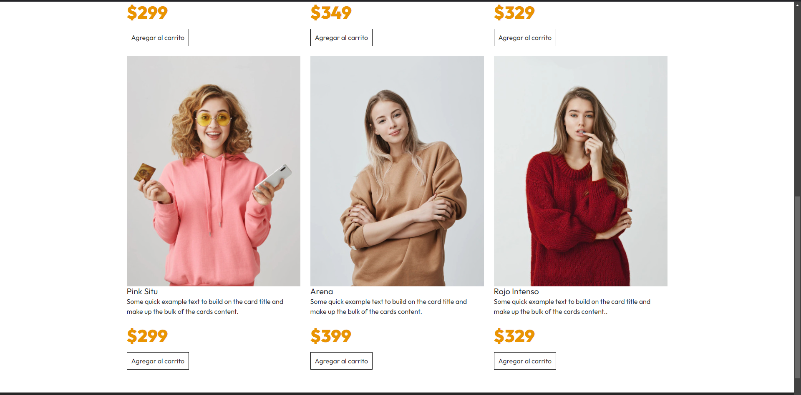

Carrito de Compras 1
### Skills

**Carrito de Compras - Aprendiendo las Bases de React**

Este proyecto consistió en desarrollar un carrito de compras básico para adentrarme en las bases de React. El objetivo principal era construir una aplicación funcional mientras aprendía conceptos fundamentales del desarrollo frontend utilizando tecnologías como **React**, **CSS**, y **Vite**.

### **Retos Enfrentados**

A lo largo del desarrollo, encontré varios desafíos que me ayudaron a mejorar mis habilidades:

- **Gestión de Estado**: Aprender a usar `useState` fue clave para manejar los cambios en la aplicación de forma eficiente.
- **Consumo de Datos**: Acceder a información desde un archivo JSON y estructurar los datos para mostrarlos en la interfaz.
- **Comunicación entre Componentes**: Pasar datos y funciones entre componentes me ayudó a entender cómo interactúan las diferentes partes de una aplicación React.
- **Optimización con useMemo**: Implementé `useMemo` para memorizar valores calculados y actualizar solo cuando las dependencias cambiaban, lo cual mejoró el rendimiento y consolidó mi comprensión de este hook.
- **Gestión de Estado Dinámico**: Aprendí a actualizar el estado de forma dinámica según las acciones del usuario, como incrementar o disminuir la cantidad de productos en el carrito. Este reto me permitió entender mejor cómo React maneja los eventos y cómo el estado refleja esos cambios en tiempo real en la interfaz.
- **Manipulación de Arrays**: Aplicar métodos como `reduce` para calcular el total del carrito.
- **Propagación de Funciones**: Transmitir funciones y sus propiedades entre componentes fue un pequeño reto, pero importante para comprender mejor el flujo de datos en React.

Este proyecto fue muy bueno para mejorar mis conocimientos en React. Logré mejorar mi manejo de `useState` y comprendí mejor la importancia de optimizar componentes con herramientas como `useMemo`. También adquirí fluidez en la manipulación de datos con métodos de arrays y en el diseño de componentes reutilizables.

https://github.com/daniel-mena2000/REACT/edit/master/1.carritoDe-compras/README.md

