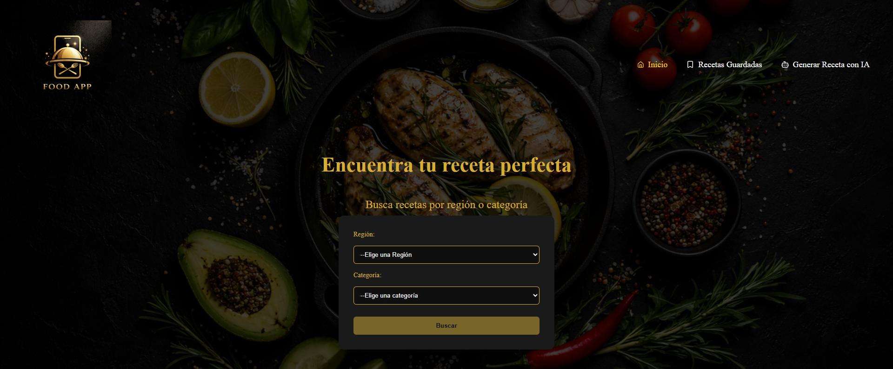
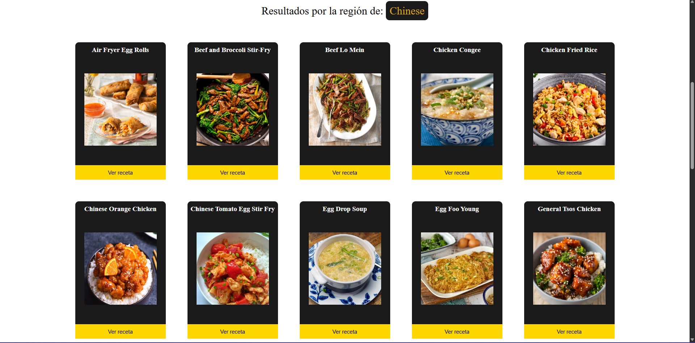
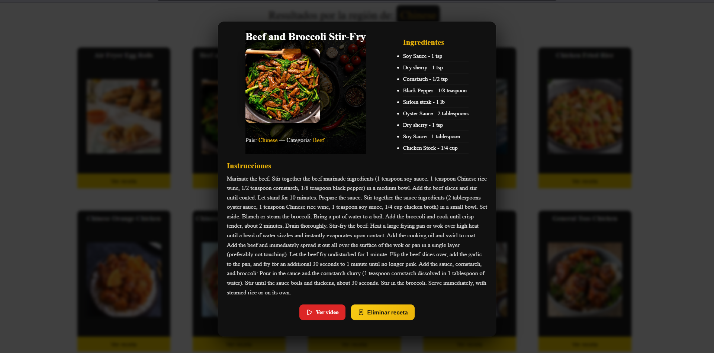
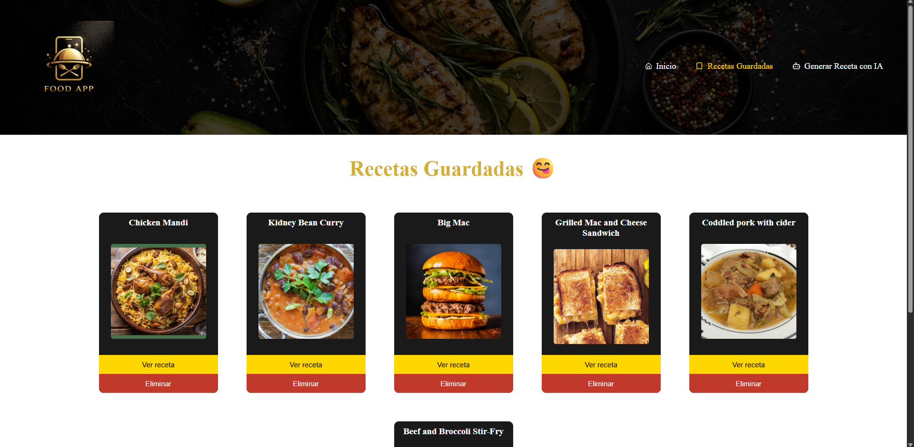
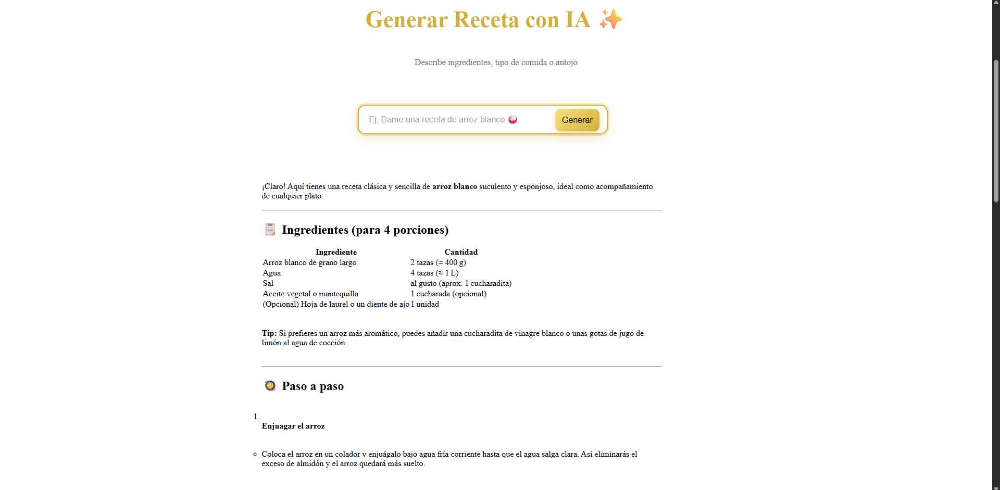

<a href="https://tailwindcss.com/" target="_blank" rel="noreferrer">

---

---

---

---

---

---
# -- 🟩 Implementación del Proyecto --

## 📱 Estructura:

- Página principal: filtros de comidas con región o categoría
- Página recetas guardadas: tus platillos favoritos guardados
- Página IA: generador de recetas asistido

## 🔍 Función 1: Explorador de Comidas (TheMealDB API)

- Busca platillos por región (país)
- Busca platillos por categoría (tipo de comida)
- Ve detalles: ingredientes, país, instrucciones, video
- Marca favoritas que se guardan localmente

## 🤖 Función 2: Generador IA (OpenRouter API)

- Escribe: ingredientes, antojo o tipo de comida
- La IA genera 3 recetas diferentes automáticamente
- Respuesta en tiempo real (streaming)
- Usa modelos gratuitos de OpenRouter

## Tecnología:

- React + TypeScript
- Tailwind CSS para estilos
- Vite como bundler
- Integración con OpenRouter API para generar recetas con IA

## Estado y Validación:

- Zustand 5.0.11 (gestión de estado)
- Zod 4.3.6 (validación de esquemas)

## UI y Componentes:

- Radix UI (React Dialog) 1.1.15
- Lucide React 0.577.0 (iconos)

## IA y API:

- @openrouter/ai-sdk-provider 2.3.1
- AI (Vercel AI SDK) 6.0.116
