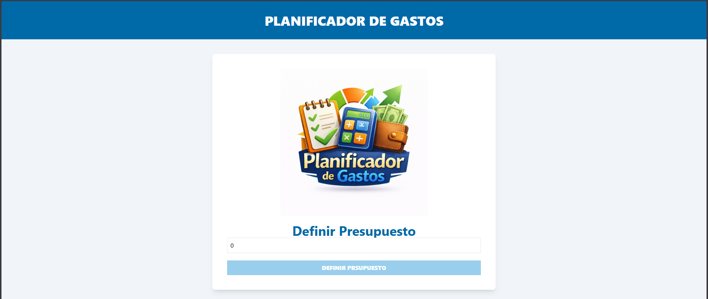
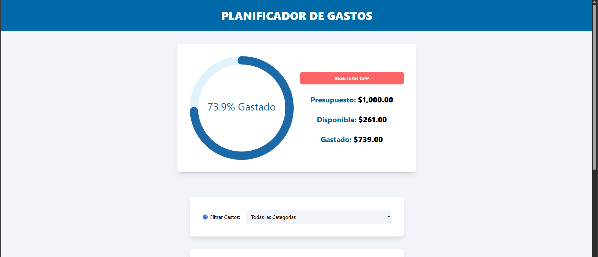
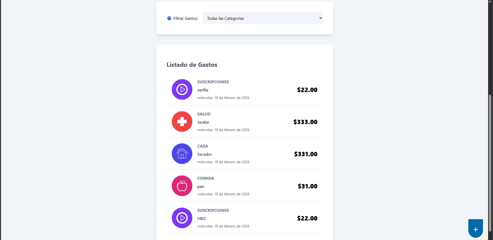

  
  
  
  
  
  
  

# -------------------------- 🛠️ Implementación Técnica del Proyecto -------------------------

## 🌐 1. Gestión de Estado Global con Context API y useReducer

Implementar un sistema de estado centralizado combinando Context API con useReducer para manejar múltiples acciones (agregar, editar, eliminar gastos, filtros, modales) manteniendo el código organizado y tipado correctamente con TypeScript.

## 🧩 2. Tipado Estricto con TypeScript

Definir tipos precisos para el estado, acciones del reducer y props de componentes. Particularmente desafiante fue tipar las acciones discriminadas (BudgetAction) y manejar tipos externos como Value de react-date-picker.

## 💾 3. Persistencia con LocalStorage

Sincronizar el estado de la aplicación con localStorage para mantener el presupuesto y los gastos entre sesiones, incluyendo la hidratación inicial del estado desde storage.

## 🔄 4. Lógica de Edición vs Creación

Manejar un mismo formulario modal para crear y editar gastos, diferenciando el flujo mediante editingId y controlando el estado previo del monto (previousAmount) para validar correctamente el presupuesto disponible.

## 📊 5. Validación de Presupuesto en Tiempo Real

Implementar validaciones que impidan gastos que excedan el presupuesto disponible, considerando tanto nuevos gastos como ediciones de gastos existentes.

## 📦 6. Integración de Librerías de Terceros

Configurar e integrar múltiples librerías (react-date-picker, react-calendar, react-swipeable-list, react-circular-progressbar) con sus estilos CSS y tipos de TypeScript.

## 🏷️ 7. Filtrado por Categorías

Implementar un sistema de filtrado dinámico que actualice la lista de gastos según la categoría seleccionada sin afectar el estado original.

---

# 🧠 ------------------ Retos Técnicos Enfrentados ----------------------

## 🔄 1. Conexión entre múltiples componentes y pantallas

Este proyecto fue uno de los más retadores hasta ahora porque tiene muchos más componentes y diferentes “pantallas”.
Por ejemplo, primero se define el presupuesto y después la aplicación cambia a la pantalla donde se agregan los gastos.

Recordar cómo se conectan entre sí los componentes y cómo fluye el estado entre ellos fue un reto importante, ya que la aplicación dejó de ser algo simple y empezó a sentirse más estructurada.

---

## 🧠 2. Comprender mejor useReducer

En proyectos anteriores trabajaba más con useState y custom hooks pasando props, pero aquí entendí mejor cómo funciona useReducer.

Al inicio fue un poco enredoso usar `dispatch` y `payload`, pero me gustó mucho la forma en que se organizan las acciones y cómo todo el estado se centraliza.
Ahora siento que es más limpio y escalable que manejar muchos estados separados.

---

## 🌐 3. Implementar Context API

Integrar useContext fue otro reto importante.
Todavía no lo comprendo al 100%, pero entendí su propósito y cómo ayuda a evitar pasar demasiados props entre componentes.

Me gustó porque hace que el código se vea más ordenado y facilita llamar estados y funciones del reducer desde cualquier parte de la aplicación.

---

## ⚖️ 4. Combinar useState con useReducer

Algo nuevo para mí fue combinar estados locales (useState) con estados globales (useReducer).

Por ejemplo:
- Guardar valores temporales en un useState.
- Validarlos.
- Y dependiendo de eso, despachar la información al reducer.

Fue interesante entender cuándo usar estado local y cuándo usar estado global.

---

## 🪟 5. Implementación del Modal

El curso pedía usar una librería para el modal, pero no era compatible con React 19.
Con ayuda de otras fuentes generé uno más simple y logré entender cómo funcionaba.

El verdadero reto fue controlar su apertura y cierre mediante acciones del reducer.
Fue un poco difícil al inicio, pero finalmente logró funcionar correctamente.

---

## 🔁 6. Uso más complejo de useEffect

En este proyecto useEffect fue más complejo que en otros anteriores, porque dependía del estado global del reducer.

Dependiendo de ciertos cambios, se ejecutaban efectos como la sincronización con localStorage.
Fue algo más avanzado para mí, pero logré entender cómo controlar sus dependencias.

---

## 📝 7. Manejo de múltiples escenarios en el formulario

El formulario puede:
- Agregar gastos
- Editar gastos
- Eliminar
- Reiniciarse en distintos momentos

Implementar todos estos escenarios fue algo enredoso, porque dependiendo de la acción se debían reiniciar ciertos estados.

Fue uno de los retos más interesantes, ya que me obligó a pensar mejor la lógica del flujo de la aplicación.
