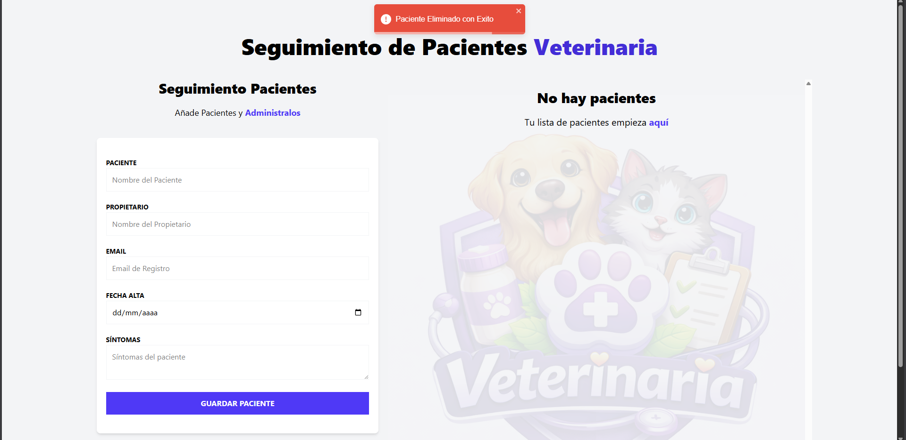
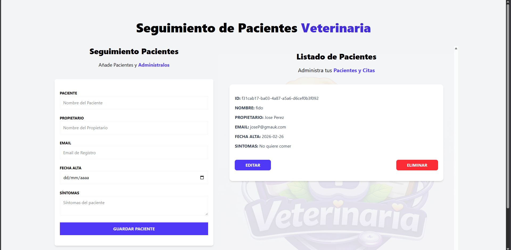

---

---
# ------------- 🛠️ Implementación Técnica del Proyecto -------------

Descripción del Proyecto — Pacientes Zustand

## 🏥 1. Gestión de Estado Global con Zustand
Implementar un sistema de estado centralizado usando Zustand para manejar múltiples acciones (agregar, editar, eliminar pacientes) con middlewares de devtools (integración con Redux DevTools) y persist (persistencia automática), manteniendo el código organizado y tipado con TypeScript.

## 🧩 2. Tipado Estricto con TypeScript
Definir tipos precisos para el estado del store (PatientState), las entidades (RegisterPatientType) y variantes sin ID (DraftPatient usando Omit<>). Particularmente relevante fue la distinción entre un paciente completo (con id generado por UUID) y un borrador del formulario, asegurando que las acciones del store reciban y retornen los tipos correctos.

## 💾 3. Persistencia con LocalStorage
Sincronizar el estado de la aplicación con localStorage mediante el middleware persist de Zustand, almacenando la lista de pacientes bajo la clave patient-store para mantener los registros entre sesiones sin necesidad de lógica manual de hidratación.

## 🔄 4. Lógica de Edición vs Creación
Manejar un mismo formulario para crear y editar pacientes, diferenciando el flujo mediante activeId. Cuando se pulsa "Editar" en un paciente, se establece su ID como activo, un useEffect detecta el cambio y precarga los datos en el formulario con setValue de React Hook Form. Al enviar, se determina si se ejecuta addPatient o updtaePatient según el estado de activeId.

## ✅ 5. Validación de Formularios con React Hook Form
Implementar validaciones declarativas en cada campo del formulario: campos requeridos, longitud máxima de caracteres y validación de formato de email mediante expresiones regulares, mostrando mensajes de error personalizados a través de un componente Error reutilizable.

## 📦 6. Integración de Librerías de Terceros
Configurar e integrar múltiples librerías: React Hook Form para validación de formularios, React Toastify para notificaciones visuales (éxito al crear, info al editar, error al eliminar), UUID para generación de identificadores únicos, y Tailwind CSS v4 para estilizado utilitario con diseño responsive.

## 🗂️ 7. Patrón CRUD Completo
Implementar las cuatro operaciones fundamentales sobre la entidad paciente: Crear (formulario → addPatient → genera UUID), Leer (listado reactivo desde el store), Actualizar (precarga en formulario → updtaePatient → resetea activeId) y Eliminar (deletePatient con filtrado por ID), todo gestionado desde un único store de Zustand.
