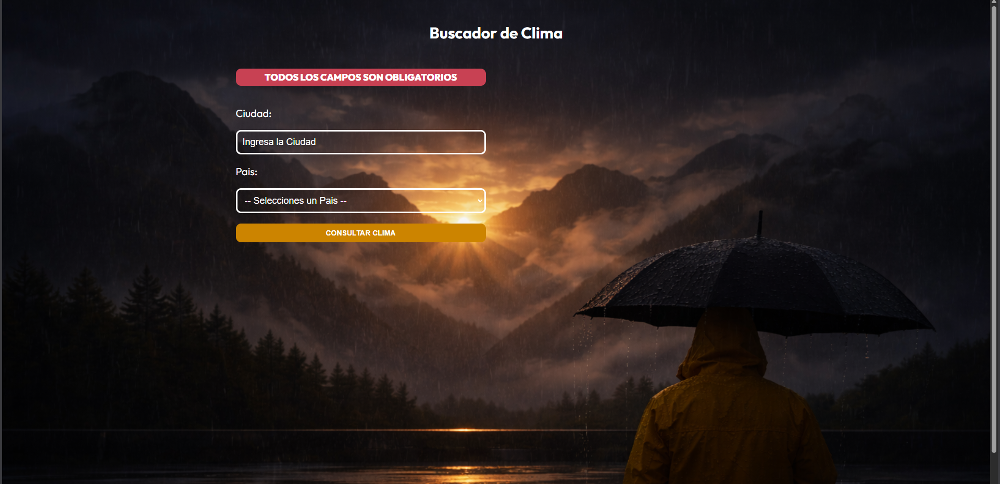

---

---

# Características principales:

## 🌤️ Funcionalidad:

•  Permite buscar información del clima de ciudades en diferentes países
•  Utiliza la API de OpenWeatherMap para obtener datos meteorológicos
•  Muestra temperatura actual, máxima y mínima

## 🛠️ Stack tecnológico:

•  React 19 + TypeScript para la interfaz
•  Vite como build tool
•  Axios para peticiones HTTP a la API
•  Zod para validación de datos y type safety
•  CSS Modules para estilos

## 📦 Estructura:

•  Formulario de búsqueda por ciudad y país
•  Componente de detalles del clima
•  Spinner de carga durante las peticiones
•  Alertas cuando no se encuentra una ciudad
•  Hook personalizado useWeather que maneja toda la lógica de peticiones y estado.

---

🚀 Retos del Proyecto – App de Clima
🎨 Uso de CSS Modules

• Este proyecto lo empecé usando algo nuevo para mí: CSS Modules
• Me parecieron bastante eficientes porque cada componente tiene su propia hoja de estilos
• Me gustó mucho la separación y organización que se logra

Este proyecto me ayudó a entender mejor cómo mantener estilos encapsulados sin afectar otros componentes.

🧠 Implementación de Zod para validación

• Uno de los principales retos fue implementar Zod para validar las respuestas de la API
• TypeScript por sí solo no sabe exactamente cómo vienen las respuestas externas
• Tuve que definir los schemas correctamente para asegurar el tipado
• Fue interesante entender cómo validar y tipar al mismo tiempo
• Consideré usar Valibot, pero decidí dejarlo con Zod

Este punto fue clave porque entendí la diferencia entre confiar solo en TypeScript y validar realmente los datos en runtime.

🌐 Consumo de API

• Utilicé Axios para las llamadas HTTP
• No representó un reto grande, ya que ya tenía experiencia previa
• Me enfoqué más en la estructura y validación que en la petición en sí

🧩 Conclusión personal

• No fue un proyecto con retos extremadamente complejos
• Me ayudó a reforzar conceptos como validación, tipado seguro y separación de responsabilidades
• Me permitió experimentar con nuevas herramientas como CSS Modules
