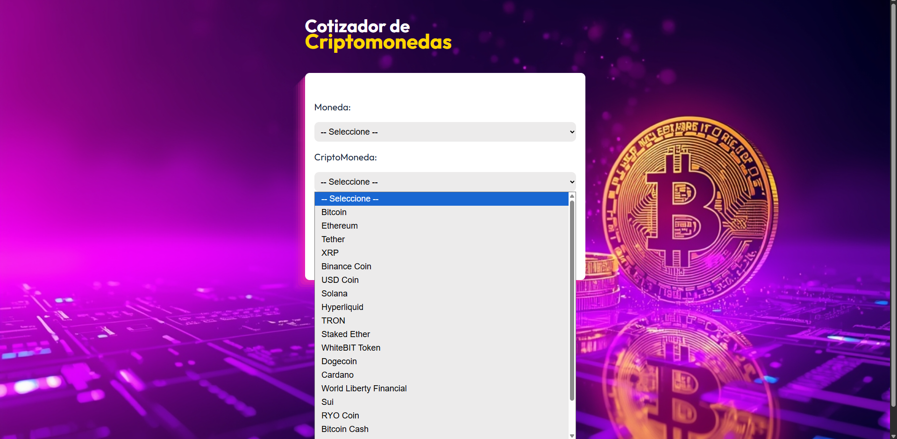
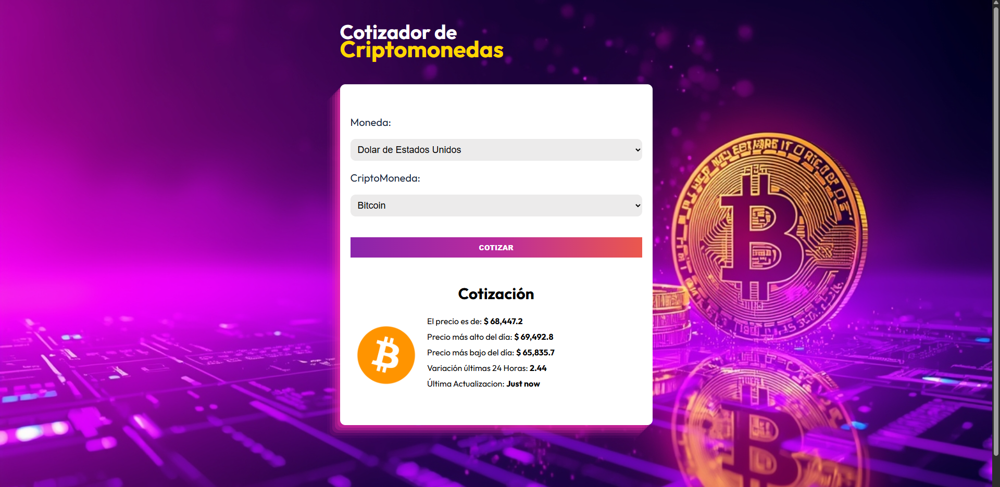

---

---

# -- 🟩 Implementación Técnica del Proyecto --

### ¿Qué hace?

Permite al usuario seleccionar un par de divisas (moneda fiat + criptomoneda) y consultar en tiempo real el precio actual de esa criptomoneda.

### Funcionalidad principal:

•  Carga las top 20 criptomonedas por capitalización de mercado desde la API de CryptoCompare
•  El usuario elige una moneda fiat (USD, MXN, EUR, GBP) y una criptomoneda
•  Al hacer clic en "Cotizar" muestra: precio actual, máximo/mínimo del día, cambio porcentual en 24h e imagen de la cripto

### Stack técnico:

•  React 19 con TypeScript para la UI
•  Zustand para el manejo de estado global
•  Axios para las peticiones HTTP a la API
•  Zod para validación de esquemas de datos de la API
•  Vite como bundler

### Estructura:

•  components/ — Formulario de búsqueda y display de precios
•  services/ — Llamadas a la API de CryptoCompare
•  store.ts — Estado global con Zustand
•  schema/ — Validación de respuestas con Zod
•  data/ — Lista estática de monedas fiat disponibles

# -- 🧩 Retos Técnicos Enfrentados y Aprendisaje --

Este proyecto me ayudó a profundizar en el consumo de APIs dentro de aplicaciones React y a reforzar conceptos importantes relacionados con la gestión de datos y la arquitectura del proyecto.

Uno de los principales retos fue trabajar nuevamente con **formularios y validación de datos**, especialmente al manejar información proveniente de una API externa. Para evitar errores en tiempo de ejecución, se implementó **Zod** para definir esquemas que validan la estructura de los datos recibidos antes de utilizarlos dentro de la aplicación.

También se volvió a utilizar **Zustand** para el manejo del estado global, lo que permitió compartir información entre distintos componentes de forma sencilla. Esto incluye datos como las criptomonedas disponibles, las divisas seleccionadas por el usuario y el resultado de la cotización.

El uso de **TypeScript** fue clave para definir correctamente los tipos de los datos recibidos desde la API. Al combinar TypeScript con la validación de Zod, se logró mantener un flujo de datos más consistente, seguro y tipado dentro de la aplicación.

Finalmente, para mantener el proyecto organizado y escalable, se separaron claramente las responsabilidades del código en diferentes capas: componentes de interfaz de usuario, servicios encargados de las llamadas a la API, manejo del estado global con Zustand y validación de datos mediante esquemas con Zod.
