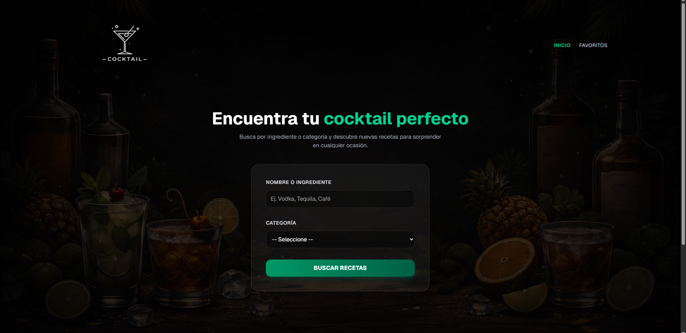
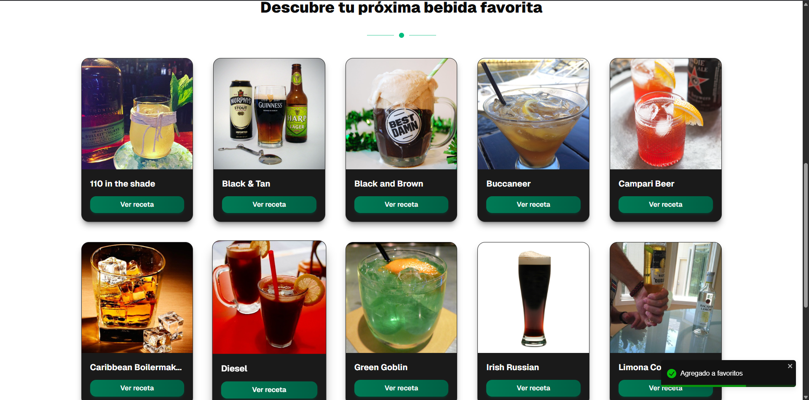
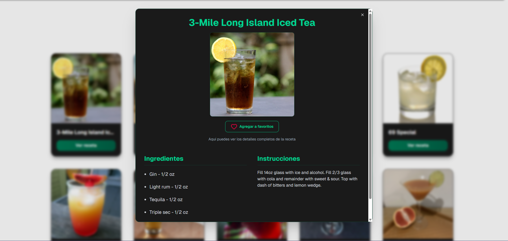
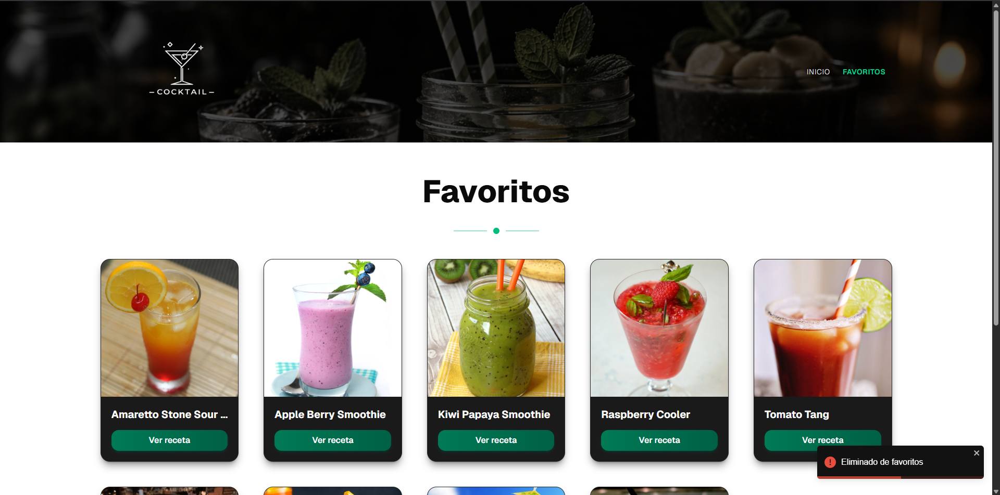

---

---

# -- 🟩 Implementación del Proyecto --

### Funcionalidad principal:

•  Permite buscar cócteles filtrando por categoría e ingrediente, consumiendo la API pública de TheCocktailDB
•  Al seleccionar una bebida, muestra su información detallada (instrucciones, ingredientes y medidas) en un modal
•  Permite guardar bebidas como favoritas, persistiendo los datos en localStorage
•  Tiene una página de favoritos donde se listan las bebidas guardadas

### Stack tecnológico:

•  React 19 con TypeScript
•  Zustand para manejo de estado global (dividido en slices: recipeSlice y favoritesSlice)
•  React Router DOM v7 para navegación (rutas: / y /favorites)
•  Axios + Zod para fetching y validación de datos de la API
•  Tailwind CSS v4 + shadcn/ui (Radix UI) para los estilos y componentes de UI
•  React Toastify para notificaciones

---

# -- 🟩 Retos y aprendizajes del proyecto --

Este proyecto de bebidas ha sido el más complejo que he desarrollado hasta ahora, ya que integra muchos de los conceptos que aprendí en proyectos anteriores, pero esta vez conectados dentro de una aplicación completa. Durante su desarrollo enfrenté varios retos técnicos que me permitieron profundizar en herramientas y patrones importantes del ecosistema de React.

## Implementación de enrutamiento con React Router

Uno de los aprendizajes más importantes fue trabajar con **React Router** para estructurar las rutas de la aplicación. Gracias a esta librería es posible navegar entre páginas sin recargar el navegador, lo que mejora significativamente la experiencia del usuario.

Para organizar mejor la aplicación implementé un **Layout compartido**, que actúa como un componente envolvente para las distintas rutas. Dentro de esta estructura se utiliza `Outlet`, que funciona como un marcador donde React Router renderiza la ruta hija que coincide con la URL actual.

También aprendí el papel de **BrowserRouter**, que actúa como el contenedor principal del sistema de rutas y se encarga de escuchar los cambios en la URL para actualizar la vista sin recargar la página.

Dentro de la estructura de rutas utilicé `Routes` y `Route` para definir las páginas de la aplicación. Además, en lugar de utilizar enlaces HTML tradicionales, utilicé `NavLink`, que permite navegar entre rutas y aplicar estilos dinámicos al enlace activo.

---

## Organización del estado global con Zustand y slices

Otro reto importante fue estructurar el estado global utilizando **Zustand**.

Aunque en este proyecto solo utilicé dos slices, decidí implementar esta arquitectura para comenzar a acostumbrarme a una forma más escalable de organizar el estado pensando en proyectos más grandes.

Se crearon dos slices principales:

**recipeSlice**

Encargado de manejar:

- las recetas obtenidas desde la API

- la búsqueda de bebidas

- el estado del modal que muestra la información detallada de cada receta

**favoritesSlice**

Encargado de manejar:

- la lista de bebidas favoritas

- la lógica para agregarlas o eliminarlas

- la persistencia de estos datos

Ambos slices se combinan dentro del store principal, lo que permite mantener el estado global organizado y fácil de mantener.

---

## Manejo de notificaciones y compatibilidad de librerías

Durante el desarrollo del proyecto surgió un problema con **Headless UI**, ya que actualmente no es totalmente compatible con **React 19**.

Aunque puede parecer un detalle pequeño, para mí fue un reto porque impedía continuar con la implementación de las notificaciones dentro del proyecto.

Para resolver este problema decidí utilizar **React Toastify**, una librería que ya había utilizado en proyectos anteriores. Gracias a esta experiencia previa pude integrarla rápidamente y resolver el conflicto, manteniendo las notificaciones dentro de la aplicación.

Este tipo de situaciones me obligan a investigar alternativas y encontrar soluciones cuando una herramienta no funciona como esperaba.

---

## Validación de datos con Zod

También trabajé con **Zod** para validar los datos obtenidos desde la API.

Aunque ya comprendo su funcionamiento, todavía representa un reto adaptarme a las distintas estructuras de datos que pueden devolver las APIs. Cada API puede tener formatos diferentes, por lo que es necesario analizar su respuesta y construir correctamente el esquema de validación.

Aun así, considero que Zod es una herramienta muy poderosa para asegurar la integridad de los datos dentro de una aplicación.

---

## Conclusión

Este proyecto me permitió consolidar varios conceptos clave del desarrollo con React, como el manejo de rutas, el estado global, la validación de datos y la integración de librerías externas. También me ayudó a enfrentar problemas reales de compatibilidad y a buscar soluciones alternativas cuando una herramienta no funcionaba como esperaba.
